#  Predicting Desire Paths: Agent-Based Simulation for Neighbourhood Route Planning

Józef Bossowski $^{a}$, Tomasz Szandała $^{a,b,*}$, Jacek Mazurkiewicz $^{a}$

$^{a}$ Wroclaw University of Science and Technology, Wroclaw, Poland

$^{b}$ The University of Applied Sciences and Arts of Southern Switzerland (SUPSI), Lugano, Switzerland

##  ARTICLE INFO

##  Keywords:

Agent-based simulation

Desire paths

Urban route planning

Pedestrian behaviour modelling

Obstacle avoidance model

##  ABSTRACT

This study addresses how informal “desire paths” emerge when urban infrastructure does not align with pedestrian preferences, focusing on small, local neighbourhoods to bridge a recognised research gap in urban planning. It introduces an agent-based modelling (ABM) framework that builds on path optimisation, affordance theory, and two novel models: a weighted preferences model that accounts for varied pedestrian priorities beyond route length and an obstacle avoidance model that achieves 60 % accuracy, indicating it can successfully replicate aspects of natural navigation, but still showing potential for further refinements. Conducted in three-dimensional simulations using Unity3D and the Agent-Based Modelling for Unity (ABMU) toolkit, this approach yields complex path networks that illuminate pedestrian decision-making processes and highlight the impact of diverse priorities, including local optimisation of route length, on network efficiency. By clarifying these ABM-driven insights, we underscore the significance of integrating multiple pedestrian preferences into urban planning to foster more sustainable development in local neighbourhoods.

##  1. Introduction

In an era of rapid urban development and the expansion of residential areas, the appropriate design of transport networks has become a crucial aspect of urban planning (Almulhim & Cobbinah, 2023; Chan, Schwanen, & Banister, 2021; Cocola-Gant, Gago, & Jover, 2020; Sopiana & Harahap, 2023). A common phenomenon in inhabited areas is the emergence of so-called "desire paths" (Farrier, 2020). These are routes that pedestrians create through their repeated use of a particular route, often in direct conflict with the idealised designs of urban planners. These paths, which can be seen in both older spaces and newly developed neighbourhoods, are a clear indication of a lack of understanding of residents' needs by designers, changes in those needs, or unforeseen developments in urban spaces.

Computer simulations provide advanced tools for the analysis and design of transport networks (Huang et al., 2022; Kaziyeva, Stutz, Wallentin, & Loidl, 2023; Torrens & Gu, 2023; Zare, Leao, Gudes, & Pettit, 2024). Pedestrian traffic simulations allow for assessing urban infrastructure regarding safety and capacity. They can also support the creation of infrastructure that aligns with pedestrian behaviour. Using such models can help prevent issues related to "desire paths" and better

address the needs of urban space users (Filomena & Verstegen, 2021). Improving neighbourhood pedestrian paths can significantly benefit the natural environment by reducing the creation of informal desire paths, often leading to the degradation of green areas and increased soil erosion. Properly planned pedestrian infrastructure that aligns with user preferences minimises environmental disturbances and supports biodiversity conservation by preserving natural habitats and preventing fragmentation (Rhoads, Solé-Ribalta, & Borge-Holthoefer, 2023).

Among the various methods of simulating pedestrian traffic, agent-based simulations offer unique capabilities for modelling behaviour. Focusing on individual behaviour and preferences is a natural choice for analysing infrastructure alignment with pedestrians' actual needs.

This paper aims to study various pedestrian traffic simulation methods using agent-based models in the context of the formation of desired paths.

The work begins with an analysis of existing pedestrian traffic simulation methods. This analysis includes both classical simulation models and agent-based models. Our primary goal is to extend and enhance Ma et al.'s model, creating a more comprehensive agent-based framework that better aligns simulated behaviour with observed human movements.

Within this context, we pose several key research questions: (1) How can agent-based simulations more accurately capture the conditions leading to desire path formation, including local optimisation trade-offs and varied pedestrian preferences? (2) To what extent does incorporating a weighted preferences model enable us to identify and understand deviations from simple shortest-path routing? (3) How does introducing obstacle avoidance strategies improve realism when simulating complex urban layouts compared to the baseline approaches advanced by Ma et al.? By structuring our literature review and analysis around these questions, we highlight the gaps in existing research and demonstrate how our proposed models address these issues.

A test environment was implemented to run and compare the models. The program was developed using the Unity3D engine (Unity Technologies, 2024) and the C# programming language. An integral aspect of this study was the creation of clear, immersive visualisations to communicate agent-based simulations to stakeholders and prospective users. Unity3D's robust 3D rendering capabilities and user-friendly interface proved invaluable for constructing interactive environments that depict how pedestrians form desire paths. While other approaches could have produced similar numerical outputs, the 3D environment allowed non-technical collaborators to swiftly comprehend complex scenarios, enhancing collaborative decision-making and facilitating iterative refinements of the simulation. Moreover, Unity3D's flexibility fosters broader engagement, ultimately bridging the gap between theoretical models and practical urban planning applications.

This work based on the model proposed by Ma et al. (Ma, Brandt, Seipel, & Ma, 2024). All proposed models operate in a two-dimensional continuous space, considering various types of terrain. To compare the results of these models, appropriate metrics for model quality assessment were investigated and used. The accuracy of the models in replicating real-world paths was also tested.

#  2. Literature review

At the end of the 19th century, collective behaviour research began to take shape, closely linked to the rapid growth of urban culture and, consequently, urban spaces (Goheen, 1993). In 1895, in the book Psychologie des Foules (Le Bon, 1896; Maciak & Barański, 2015), Gustave Le Bon coined the term "crowd psychology" to describe how individuals behave differently when part of a crowd compared to when they are alone. In the 20th century, studies on collective behaviour gained importance, especially in the context of urbanisation and the increasing population in cities (Parysek, 2010). Key figures in the development of these studies were sociologists and social psychologists who aimed to understand the mechanisms governing crowd behaviour. An example is the work of Elliot Aronson (Aronson, Wilson, & Akert, 1994), who studied the influence of conformity on individual behaviour within groups.

##  2.1. Agent-based simulations

In the 1970s, with the advent of computer technology, agent-based simulations (Agent-Based Modelling) began to be used. One of the earliest known models is Thomas Schelling's dynamic segregation model (Schelling, 1971), which aimed to explain racial and class divisions observed in cities through the simple decisions made by residents.

In the following years, these simulations were dynamically developed and applied in economics, urban planning, and computer graphics fields. Craig Reynolds' "Boids" (Reynolds, 1987) is a notable example of a more dynamic agent-based model. This model simulates the behaviour of flocks of birds, land animals, or schools of fish, allowing the automatic creation of naturally looking animations that were previously manually crafted. It relies on three basic individual behaviours:

1. Collision avoidance: The agent adjusts its direction to avoid collisions with others.

2. Speed matching: The agent aligns its movement speed with neighbouring units.

3. Flock centring: The agent moves towards the centre of the perceived group.

This bottom-up behavioural design approach is at the core of agent-based modelling methods (Downey, 2012). Classic models propose rules to approximate observed phenomena, while agent-based models use simple rules governing individual agents, assuming that these generate the observed effects rather than top-down laws.

A central component of agent-based simulation is the agent whose behaviour is modelled. According to Ronald et al. (2007) (Ronald Sterling, Kirley, et al., 2007), the agent is characterised by the following features:

● Situated – Exists within an environment.

● Autonomous – Independent, not externally controlled.

● Reactive - Responds to environmental changes in a timely manner.

● Proactive- Has a goal and strives to achieve it.

● Flexible - Can achieve the goal through multiple strategies.

● Resilient – Continues to act even after failure.

● Social – Interacts with other agents.

##  2.2. Pedestrian behaviour modelling

Human behaviour is difficult to model, but agent-based modelling enables micro-scale behaviour analysis. In the agent-based approach, agents represent pedestrians in a continuous or discrete space where they can move. The decision-making process can be divided into several repeatable steps (Ronald et al., 2007):

1. Perception – The agent observes relevant environmental elements.

2. Decision – Based on the state of the environment, the agent decides its next action.

3. Action – Executes the action aligned with the decision.

4. Learning – Depending on the model, agents may be able to learn, adapting their behaviours and decisions as the environment changes.

Agents' perceptions vary depending on the scale and goals of the simulation. However, it is always limited to their immediate surroundings, modelling human perceptual constraints.

For years, psychologists have studied human decision-making processes. Given the complexity of the human psyche, various models of decision-making have been developed, and these can be divided into three main categories (Lee, Son, & Jin, 2008): economic and psychological decisions, and decisions based on synthetic engineering.

The economic approach assumes that decision-makers always act logically and rationally (Grisiute, Wiedemann, Herthogs, & Raubal, 2024). However, this approach struggles to model natural behaviours constrained by human cognitive limitations. Decisions may deviate from rationality due to stress, pressure, fatigue, or forgetfulness.

Considering these limitations, psychological models have been proposed, focusing on the variability of human behaviour in response to slight changes in tasks or environments (Payne, 1982). These often use probabilistic approaches to model the diversity of decisions (Edwards, 1962) but are criticised for placing subjects in artificial laboratory settings, which lack the depth necessary for modelling real-world behaviour.

Synthetic engineering models employ various methods and technologies to expand upon the above approaches. Decision-making rules are derived from observed behaviours in natural environments (reverse engineering). However, verifying these models is challenging due to the complex interactions of their modules.

One of the most widely used decision-making models is the BDI

model (Rao & Georgeff, 1998) (Belief-Desire-Intention). In this synthetic engineering model, a person's mental state consists of three components. Beliefs represent the individual's understanding of their surroundings, which may be incomplete or incorrect due to cognitive limitations. Desires denote the individual's needs or goals. Intentions are their actions to pursue those goals.

#  2.3. The emergence of desire paths

Desire paths (also known as “goat tracks” or “social trails”) are informal paths spontaneously created by pedestrians who seek the shortest or most convenient route between two points. They appear in places where the formal infrastructure does not meet all the needs of users, prompting them to create alternative routes. Similar paths also arise without human intervention. Animals, often moving between places important to them, also create worn paths (Farrier, 2020).

The process of desire path formation is based on several key concepts:

● Path optimisation - When moving, people naturally tend to use the easiest routes. This approach is called the principle of least effort in psychology (Zipf, 2016).

● Perception of space - The perception of space influences decisions regarding the chosen path. Factors shaping decisions can be the visibility of obstacles, the quality of the surface, or the goal itself (Lobo, Heras-Escribano, & Travieso, 2018).

● Affordance theory - Affordance is a term coined by James Gibson in the 1970s (Gibson, 1977). It refers to the various possibilities for action offered by the environment. The presence of open spaces, the natural shape of the terrain, and other aspects of the environment can suggest the existence of alternative paths that are more attractive to pedestrians.

● Collective behaviour - Upon noticing that other pedestrians are using an alternative path, a person is more likely to use it (Aronson et al., 1994). Furthermore, depending on the person's character and situational factors, they are inclined to use the unofficial path to varying degrees. When the path is already significantly worn, more people will use it than in the initial stages of its formation when it is mainly used by people who are more courageous or under pressure (e.g., time pressure - hence the search for a shorter path).

As can be seen, there are many psychological mechanisms that create positive feedback resulting in the formation and maintenance of desire paths. Their location is largely related to the places of interest between which pedestrians move. For this reason, in developing spaces (e.g., suburban housing estates), the existing infrastructure may eventually cease to meet the needs of the changing environment. The desire paths that arise in such a situation are undesirable for many reasons. They are aesthetically unattractive, affecting the overall perception of the surroundings' appearance. They pose a safety hazard, especially during precipitation. Furthermore, the formation of such paths hinders the maintenance of (often scarce) green areas (Ćwik & Ćwik, 2011).

To protect the paths used by residents, it may be advisable to rebuild them into proper sidewalks or completely reorganise the communication system. However, this is a costly and time-consuming process. Moreover, it is a reactive process, requiring careful analysis of communication routes by the space manager.

Desire paths are, however, used to design and build pedestrian infrastructure that is better adapted to the needs of its users. An excellent example is the park that is part of the Ohio State University (OSU) campus, “The Oval” (Herrick, 1982). In 1914, construction work was underway on the OSU campus to implement Joseph Bradford’s design. The proposed paths adhered to the architect’s formal, idealistic approach. However, the work had to be suspended due to a lack of funds. In the following months, university students continued to use the campus, resulting in the creation of desire paths between frequently

connected buildings. Before resuming work, the routes designated by the students were incorporated into the project. Fig. 1 shows the differences between the initial plans and the final result of the sidewalk construction.

In pedestrian movement modelling according to the BDI model, several types of pedestrians can be identified (Ronald et al., 2007):

● Purposeful and familiar - has a goal, knows where they are going, and knows how to get there.

● Purposeful and unfamiliar - has a goal, but does not know how to reach it.

● Aimless - has no specific goal, wanders without purpose, usually for recreational purposes.

● Evacuation - in a panic related to a sudden event, people behave differently than in other situations.

● Forced waiting - queues in a store, congestion in narrow passages,but also waiting at traffic lights.

Depending on the model, agents may exhibit characteristics of one of these types, mixed characteristics, or change their type as the simulation progresses.

#  2.4. Simulations of desire path formation

Agent-based models are a good tool for analysing and simulating the process of their formation. Therefore, they can be used to check the quality of the proposed infrastructure in terms of its adaptation to the needs of residents. The use of computer simulation for this purpose allows for the identification of potential locations for the occurrence of desire paths already at the planning stage. Thanks to this, it is possible to avoid most of these types of paths and, consequently, the risks associated with them.

Helbing et al. (2001) (Helbing, Molnár, Farkas, & Bolay, 2001) applied computer simulations of “active walkers,” which are effectively an early version of agent-based simulations, to study the process of path formation. In the proposed model, pedestrians move in open space between destinations, leaving traces behind them that form paths. Due to the computational complexity of this method and limited computer resources, the method was considered inferior to iterative solving of the proposed motion equations. However, it shows a promising ability to generate natural-looking path networks that exhibit features of those observed in reality.

Real et al. (2019) (Real, Martínez-Gil, Martínez-Durá, & García-Fernández, 2019) proposed an algorithm for identifying terrain fragments suitable for road construction. Based on the terrain's shape, with the help of the A* algorithm, they determined paths with low slopes and high ease of movement. From the resulting desire paths, they select the most frequently chosen ones and, based on them, determine a map of suitability for habitation. The proposed method operates on a large scale, uses terrain shaping, but does not take into account the existing infrastructure.

Ma et al. (2023) (Ma et al., 2024) presented a simple agent-based model for generating path systems. A pedestrian was described as an agent with two visual parameters - depth and angle of vision. These parameters create the pedestrian's cone of vision. Within their cone of vision, the pedestrian sees the quality and type of substrate. The agent's action consists of three steps:

1. Turn towards the target. The pedestrian knows their goal and the general direction in which they should go.

2. Find the field with the best affordance. Within their field of vision, the pedestrian finds the substrate field with the highest affordance. This is composed of two parameters - the natural quality of the substrate and the wear caused by previous movement. The pedestrian turns towards the found field.

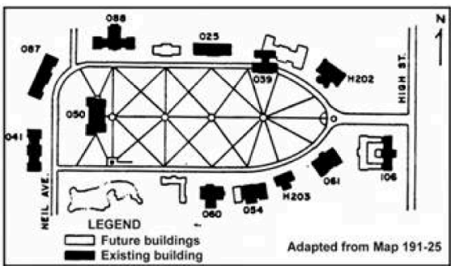

(a) The Oval plan before considering desire paths

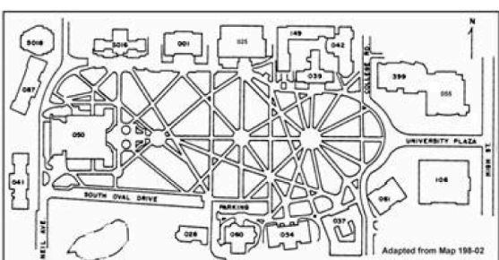

(b) The Oval plan after considering desire paths

Fig. 1. Source: (Herrick, 1982).

3. Movement. The pedestrian takes a step forward. They also leave a trace, thereby increasing the wear of the substrate.

The above simple rules of operation result in the generation of highly plausible path networks. According to the previously presented division, such an agent can be classified as purposeful and unfamiliar - they have a goal and know where it is, but they only take into account the azimuth, they do not know how to actually reach the goal. The research focused on analysing the influence of visual parameters on the resulting paths. The best results were obtained with a viewing angle in the range of 90°-120° and a viewing depth in the range of 4-8 fields.

The above simulation models pedestrian movement on a medium scale (neighbourhood), but it only works in predominantly open space due to the lack of obstacle avoidance mechanisms.

#  3. Simulation methods

In this study, agent-based models suitable for medium-scale simulations were examined. Particular attention was given to modelling behaviour in environments where obstacles are present.

The simulations were implemented using a program created with the Unity3D engine (Unity Technologies, 2024), the C# language, and the ABMU (Agent-Based Modelling for Unity) tools (Cheliotis, 2021).

The models investigated in this study are based on those proposed by Ma et al. (Ma et al., 2024).

In the simulation, agents are positioned in a two-dimensional space. They can move continuously within this space, meaning their position is represented by real number coordinates. The surface is divided into equal, square fields, which fully cover the analysed area. A field represents a section of the surface with a uniform character—it is composed of the same material, is part of the same infrastructure, and undergoes wear in a uniform manner.

To choose an appropriate route, agents evaluate the convenience of moving across a field (referred to in English as walkability). In pedestrian simulations, this convenience is called affordance. According to Gibson's theory (Gibson, 1977), affordance is the sum of resources offered by the environment to an organism. In the context of pedestrian movement simulations, this term refers to the attractiveness of a place for walking through it (Turner & Penn, 2002). In this simulation, the affordance of a field consists of two factors:

● Ground type – surfaces designed for movement, such as pavements, form the foundation of affordance. Other surfaces may be partially attractive, but in this simulation, a simplified model was used where only pavements are comfortable surfaces. Other surfaces, like roads and lawns, naturally have zero affordance.

● Footprints – the creation of desired paths is associated with frequent use of the surface by pedestrians, leading to greenery degradation. Such worn surfaces offer pedestrians a more attractive travel route. Therefore, the affordance of a field also includes the footprints left on it by pedestrians.

The affordance of fields designated as part of the infrastructure is constant. The affordance of open space fields (lawns, meadows, etc.) increases with successive simulation steps. Based on the assumption that desired paths should not become more attractive than pavements in terms of comfort, an affordance threshold of 1000 was set. If the number of footprints on a field equals or exceeds the threshold, its affordance equals that of a pavement. Below this value, the affordance increases linearly.

Depending on the type of simulation, it is possible to define a substrate map. Images in PNG format are used as maps, with each pixel corresponding to one substrate field. The pixel colour indicates what is present in the field. Specific colours are configurable depending on the map's usage, but they represent one of the following field types:

● Pavement – a field with high walkability, where footprints do not cause wear.

● Road – a field with low walkability, where footprints do not cause wear.

● Obstacle – a field through which an agent cannot pass.

● Goal – a field belonging to the pool of goals, one of the points of interest in the environment. It also acts as an obstacle.

● Open space – a field of unspecified use through which pedestrians can move. Footprints are left on it.

For visualization, basic graphical elements available in the Unity3D engine were used. Pink capsules represent agents, goals by yellow cuboids, and obstacles by black cuboids (Fig. 2a). The ground is textured with the utilised map when different surfaces are used in the simulation.

The agent possesses a visual sense, the limitations of which are described by visual parameters (Lee, 2015) (Fig. 2b). These include the visual depth $d$ and the field of view angle $\beta$. The agent's field of view is a segment of a circle with a radius $d$ and an angle $\beta$, centred directly in front of the agent. The agent moves at a speed $v$ and has a goal to pursue. The goal is one of the fields randomly selected from the pool of targets.

The steps of the simulation's operation are presented in the flowchart (Fig. 3).

##  3.1. Basic model

The basic agent behaviour model consists of the following steps:

1. Rotate towards the goal.

2. Select the field with the highest affordance (among the visible ones). If multiple fields share the same affordance, the one closest to the agent is chosen.

3. Rotate towards the field selected in step 2.

4. Move forward by $v$ fields.

5. Leave a footprint.

These steps can be mapped to the BDI framework as follows:

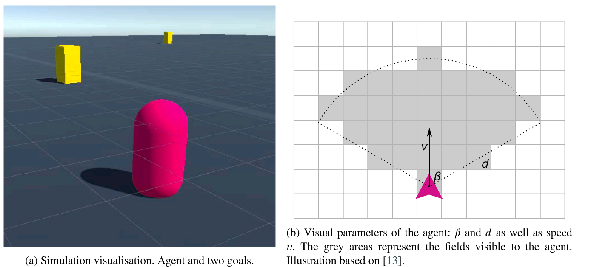

Fig. 2. Simulation perspectives.

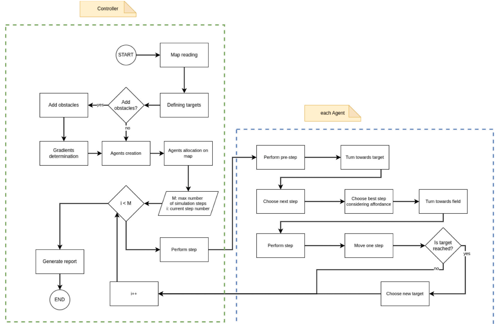

Fig. 3. Simulation flowchart.

● Belief- Step 1. The pedestrian knows the location of the goal they are trying to reach.

● Desire - Steps 2, 3. The pedestrian desires to move in the most comfortable way possible.

● Intention – Step 4. The pedestrian acts according to their beliefs and desires by moving in the selected direction.

Thus, they were also assigned to the three methods performed by each agent in a given simulation step.

#  3.2. Path minimisation principle

The next modification of the model improves the step of finding fields with the highest affordance. When multiple fields have the same

affordance, the field preferred by the pedestrian may not necessarily be the closest one (Fig. 4). As described in section 2.3, pedestrians follow the principle of least effort when choosing a route. In the context of the entire journey, the least effort does not mean selecting the nearest field but the one that deviates the least from the optimal path. Therefore, when fields with equal affordance are encountered, the field chosen will be the one for which the sum of the agent's distance to the field and the field's distance to the goal is the smallest.

#  3.3. Weighted preference principle

Pedestrians do not always choose the route with the highest convenience. Sometimes, reducing the distance travelled is more important, even at the cost of increased difficulty. This observation forms the basis for the next improvement. This enhancement introduces weights for the agent's subjective assessment of a field's affordance.

For a field with coordinates $i$ and $j$, the specific affordance is denoted as $a_{ij}$. In assessing this field, the difference between the agent's distance from its goal $d$ and the distance if the agent were to move through this field $d_{ij}$ is also taken into account. This difference is expressed as $\Delta d = d_{ij} - d$ (due to the triangle inequality). By designating weights as $w_a$ for the affordance and $w_d$ for the distance increase, the score $S_{ij}$ of a field can be expressed by eq. (1):

$$S_{ij} = w_a \times a_{ij} - w_d \times \Delta d \quad (1)$$

This scoring method allows the weights to be adjusted to change the pedestrian behaviour. In extreme cases, this evaluation reduces the model to agents always choosing the shortest path in a straight line (when $w_a$ is close to zero) or focusing entirely on affordance while ignoring the path length (when $w_d$ is close to zero), effectively behaving like the basic model (see section 3.1).

#  3.4. Obstacle-aware principle

The modification described above can operate in open spaces but do not give agents the ability to avoid obstacles. If an obstacle is placed in their path, depending on the implementation, agents may either get stuck or pass through it. To accurately model behaviour in more complex urban environments, it is necessary to include the ability of pedestrians to avoid obstacles.

Humans avoid obstacles on two levels—strategic and tactical. At the strategic level, pedestrians decide their route, knowing where obstacles are located. This approach assumes knowledge of the area. It is only suitable for avoiding static obstacles, about which it can be assumed that they are in place during the planning and execution phases. Therefore,

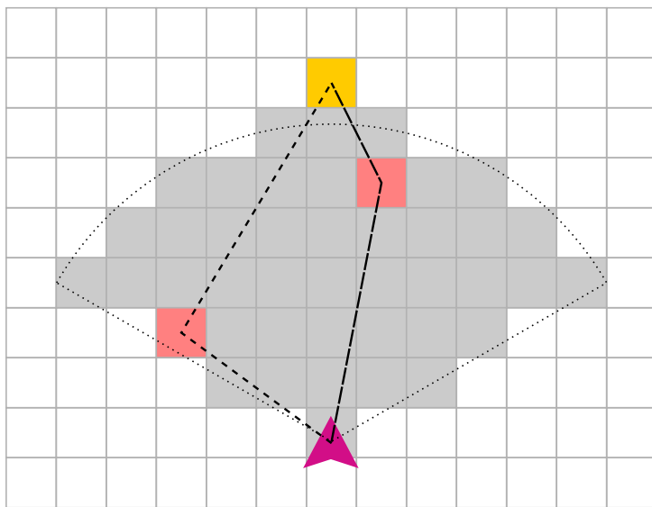

Fig. 4. Illustration of a larger path deviation when choosing a closer field.

the strategic approach works well for avoiding infrastructure obstacles (walls, buildings, ditches, hedges, barriers, etc.). At the tactical level, obstacle avoidance occurs during the journey. When a pedestrian encounters an obstacle, they decide how to bypass it. This approach does not require knowledge of the area but is cognitively more complex. It requires the ability to perceive unforeseen obstacles and react to their location. The tactical approach is practical for avoiding dynamic obstacles—those whose position may change and cannot be accounted for in the planned route.

In the model presented below, a strategic approach is used based on the assumption that the pedestrian is familiar with the area. This extension transforms the pedestrian into a goal-directed and familiar type.

To model these observations, it was necessary to adjust the path the agent takes to reach the goal. Dijkstra's algorithm (Dijkstra, 1959) was used for this purpose. At the start of the simulation, this algorithm is executed for each goal, determining the distance from each reachable field to the goal. The algorithm connects each field with eight neighbours—fields connected by edges or vertices—increasing the calculated distances' accuracy. However, this method created a problem where two obstacles are connected by a vertex (e.g., a narrow fence placed at a 45° angle). To eliminate this issue, diagonally adjacent fields are ignored if both neighbouring fields are obstacles. The resulting gradient is stored in the simulation controller.

In the first step of the agent's algorithm, instead of rotating towards the goal, the agent rotates towards the direction that brings them closest to the goal (based on the distance gradient for that goal). For this, the distances to the goal for each neighbouring field are compared, and the field with the lowest distance is selected. The agent then rotates towards that field. This means that in this model, the agent rotates in one of eight directions in the first step. While this significantly limits the freedom of movement, it is compensated for by the rotation during the search for the best field, allowing movement in any direction for viewing angles $> 45^\circ$.

Importantly, obstacles are also considered when searching for the field with the highest affordance. Only fields without obstacles are taken into account among the visible fields. Furthermore, the agent checks the visibility of a field by casting a ray from the agent's position towards the centre of the field. If the ray intersects an obstacle, the field is not visible to the agent and cannot be chosen for movement. This ensures that the agent does not move towards fields that could theoretically be in their line of sight but, for example, lie on the other side of a thin wall. If multiple fields with the same highest affordance are found, the one that increases the total distance the least is chosen (similar to the model in section 3.2).

#  3.5. Model evaluation methods

To quantitatively examine the impact of the above models on the resulting path networks, each model was assessed using two metrics: the Mean Distance Difference (MDD) and the Sum of Paths (SP). MDD is the average difference between the chosen and shortest paths (either straight-line or according to the Dijkstra gradient). It represents the extra distance pedestrians travel when taking the chosen route instead of the shortest path, disregarding infrastructure. For $n$ paths with lengths $d$ between a given pair of goals separated by a distance $d_{min}$, the MDD for that pair is expressed by the eq. (2). The graphs in chapter 4 present the average values for the entire simulation. These are calculated as the average MDD for each path completed during the simulation.

$$MDD = \frac{1}{n} \stackrel{n}{21} |d_i - d_{min}| = |d_{min} - \frac{1}{n} \sum_{i=1}^{n} d_i| \quad (2)$$

SP is the sum of areas where the number of traces left has exceeded a chosen threshold. It represents the degree of substrate wear. A smaller sum of paths indicates the creation of a more optimal communication network by pedestrians (most likely at the cost of increased MDD).

The threshold for path formation has yet to be precisely defined, which allows for a more detailed investigation of the influence of the applied model on changes in SP. In section 4, SP diagrams present the average sum of paths depending on the path formation threshold. Generally, it can be assumed that path systems with lower SP are closer to optimal - they use a shorter route length to connect destinations. However, this does not mean that they are closer to the networks created by pedestrians.

The evaluation of behavioural models is challenging to quantify. A model that better reflects people's actual behaviour will not necessarily minimise travel distance or substrate wear - it will best approximate the paths observed in reality. For this reason, the created path networks were also evaluated empirically.

The empirical evaluation is based on determining the accuracy $A_i$ (eng. Accuracy (Ma et al., 2024)), defined as the number of steps left in free space within a radius of $i$ fields from the observed path, for $i \in \{0, 2, 4\}$.

The model's accuracy was determined based on a prepared test map, representing a fragment of a housing estate in Wrocław (Lipa Piotrowska district) known to the author, where many strongly marked desire paths exist. A square area of approximately $300m \times 300m$, bounded by the streets: Waniliowa, Kaparowa, Kminkowa, and Czarnuszkowa, was selected for analysis (Fig. 5). The map was created using satellite images from Google Maps. The map was prepared as a $200 \times 200$ image, so the field size is 1.5m. Sidewalks, roads, buildings, and points of interest were marked on the map. The observed desire paths were also marked on the map. They are not used in the simulation but only to calculate the accuracy of the generated paths. Entrances to staircases, shops and restaurants, and a bus stop were marked among the latter. On the edge of the map, a point of interest was marked, symbolising a popular further route direction - towards the commercial and service complex in another part of the estate. The implementation does not differentiate between the popularity of points of interest. Therefore, places where more pedestrians travel are marked with a larger number of points of interest fields. For example, the estate residents visit the bus stop very often. It was, therefore, marked as four-pixel points of interest. Thus, the frequency of visiting the stop is four times higher than that of a standard field, e.g., a residential building. The exact values for these places were chosen arbitrarily based on observation and experience and did not precisely correspond to the actual frequency of visits.

#  3.6. Conducted research

In order to collect the data necessary to determine the above evaluations, two simulation scenarios were carried out. The first scenario assumes the generation of 20 randomly placed buildings on an area of $100 \times 100$ fields (Fig. 7a). The placement of buildings is randomised using the same seed, which results in an identical distribution of buildings between simulations and, thus, comparable research results. The second scenario occurs on the above estate map (see section 3.5). In the first scenario, all created agent control models were compared. Due to the obstacles on the map, only the obstacle avoidance model is considered for the study in the second scenario (see section 3.4). Only one of the discussed models is capable of avoiding obstacles. Therefore, two of its modifications were investigated in this scenario. The first is a hybrid model, combining obstacle avoidance and nearest field selection - analogous to the basic model. The next one is a limited simple model, aiming for the target by the shortest path - completely ignoring the affordance of the fields.

The same parameters presented in Table 1 are used in each simulation run. The visual parameters were selected based on the optimal values determined by Ma et al. (Ma et al., 2024).

In the case of the weighted preferences model (see section 3.3), simulations were conducted to check the influence of weight proportions on the generated paths. In the experiments, weights with proportions ($w_a : w_d$) from the set $\{1 : 1, 1 : 2, 1 : 4, 1 : 8\}$ were considered.

#  4. Discussion

As a result of the simulations described in the previous section, the formation of complex path networks could be observed. Furthermore, the results of MDD, SP, and accuracy values are compared below.

Table 1

Parameters of the conducted simulations

| Parameter | Value |
| --- | --- |
| Number of agents | 100 |
| Speed v | 1 [field] |
| Vision radius d | 15 [fields] |
| Vision angle β | 120° |
| Number of simulation steps | 5000 |

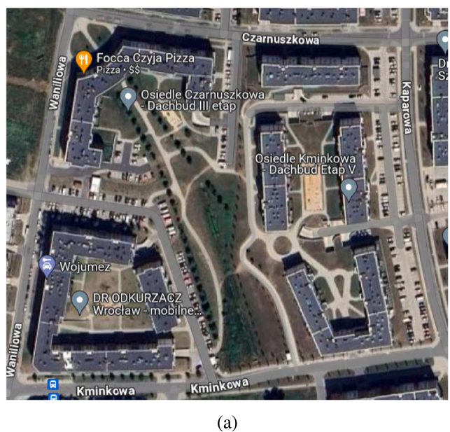

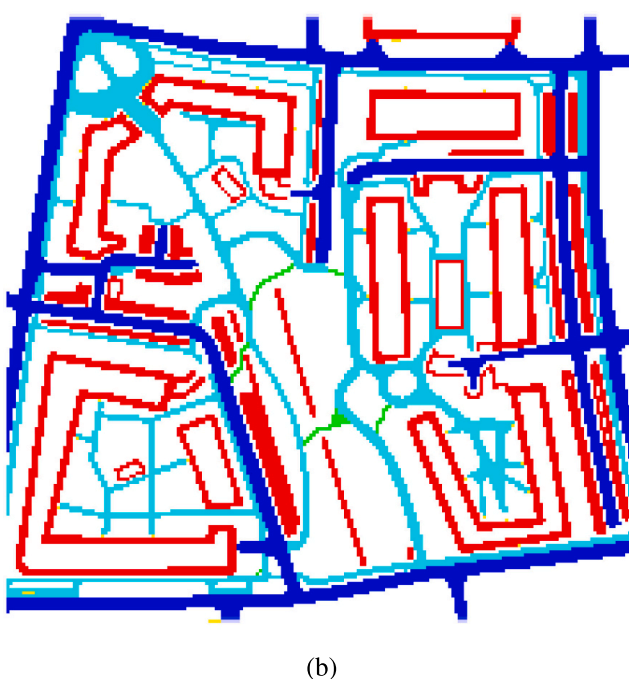

Fig. 5. Comparison of the satellite image of the mapped area (5a) with the created map (5b).

#  4.1. Weighted model

In the simulation with the random scenario, the results achieved by the weighted preferences model (see section 3.3) with different weights were compared (Fig. 6a and b). The average MDD values for the model with weights in the proportion of 1:1 were 25.5, which means that the average journey was over 25 fields longer than the shortest possible, resulting in a 24.5 % increase. The model with weights 1:8, i.e., the one favouring reducing the path length, achieved an MDD result of 15.8 - an increase in path length of 13.7 %. Such results are consistent with the assumptions and indicate that the behaviour of agents modelled in this way actually favours the appropriate behaviours.

The sum of paths created by agents favouring shorter paths was significantly lower than that of the basic agent with a weight ratio of 1:1. However, the lowest sum of paths was for weights in the proportion of 1:4 (Fig. 6c). Such results may suggest that agents' local minimisation of one's route does not lead to optimisation of the path network. Considering that the complete focus on minimising the route length would ultimately create a path network resembling a complete graph (direct connections in a straight line between each destination), the above results are consistent with intuition.

#  4.2. Random scenario

The performance of all the proposed models was compared in a simulation with a random scenario. The basic model and the path length minimising model achieved almost the same results for MDD - 22.9 (19.6 %) for the former and 23.2 (19.5 %) for the latter (Fig. 8a and b).

Differences between them can appear where many fields have equal affordance. In simulations, such a situation is relatively rare - often occurring at the beginning of the simulation, when many fields remain untouched. In the later stages of the simulation, when the paths are already strongly marked, in most situations, there will be one best field in the agent's field of vision. However, the differences between these algorithms are highlighted in the case of SP (Fig. 8c). The path length minimising model performed the best of all models, generating path systems with the smallest number of fields.

Path maps generated by the obstacle avoidance model have a much less natural character than the others (7). This characteristic is caused by the limited directions in which the agent controlled by this model rotates. In the other models, the agent rotates directly towards the target. In contrast, in the obstacle avoidance model, the agent can only rotate in the direction of one of the eight neighbouring fields. This causes the general direction of movement, even considering the choice of convenient fields, to be limited to directions every 45°. In the simulation on open space, this model performs much worse than those adapted to such operation, which can be seen in the increased MDD values. However, the sum of paths of this model is similar to that represented by other models. Although the paths that the agents move on are further from optimal and less natural because all agents have the same limitations and move similarly, the same paths are often chosen, creating a uniform network of them.

#  4.3. Real-world scenario

In the real-world scenario, versions of the obstacle avoidance model

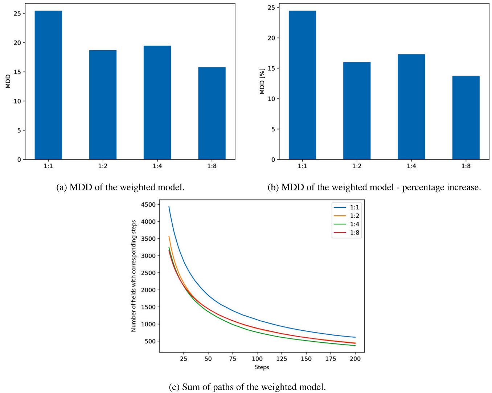

Fig. 6. Results for the weighted model.

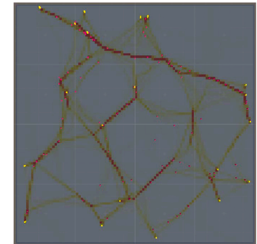

(a) Basic model.

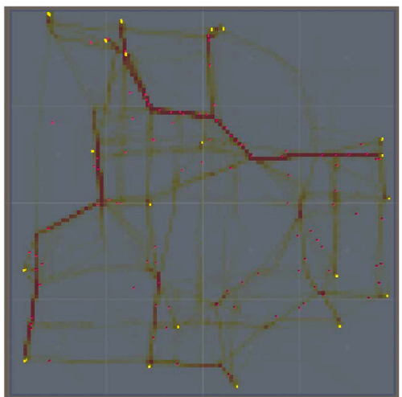

(b) Obstacle avoidance model.

Fig. 7. Top view of the path map created during the random simulation. The number of steps left is marked with colours: white - 0; yellow - middle value; red - maximum value. (For interpretation of the references to colour in this figure legend, the reader is referred to the web version of this article.)

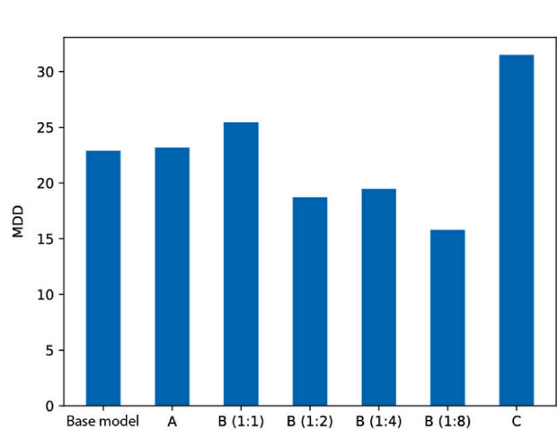

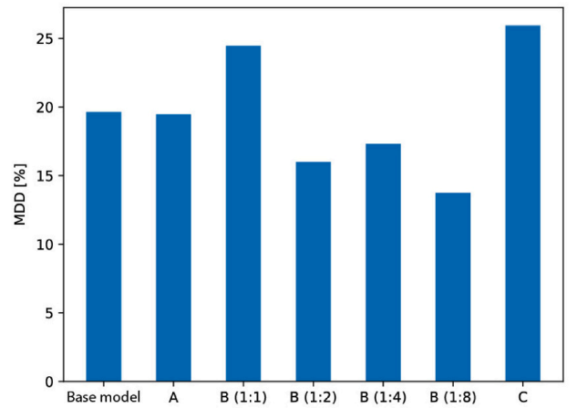

(b) MDD in the random scenario - percentage increase. A -Path minimising model; B - Weighted preferences model; C -Obstacle avoidance model.

(a) MDD in the random scenario. A - Path minimising model; B - Path minimising model; B - Weighted preferences model; C - Weighted preferences model; C - Obstacle avoidance model.    Obstacle avoidance model.

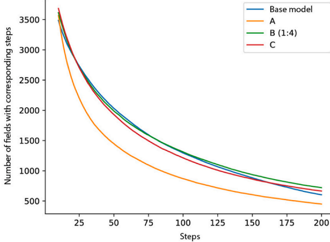

(c) Sum of paths in the random scenario. A - Path minimising model; B - Weighted preferences model; C - Obstacle avoidance model.

Fig. 8. Results for the random scenario simulation.

were compared. The achieved MDD results are consistent with expectations (Fig. 9a and b). The simple model, moving along the shortest path without considering the affordance of the fields, has a very low

MDD, close to 0. The deviation from 0 is caused only by the accuracy of the simulation - the distances from the targets in this model are determined for the centre of each field. Agents can move on any part of the

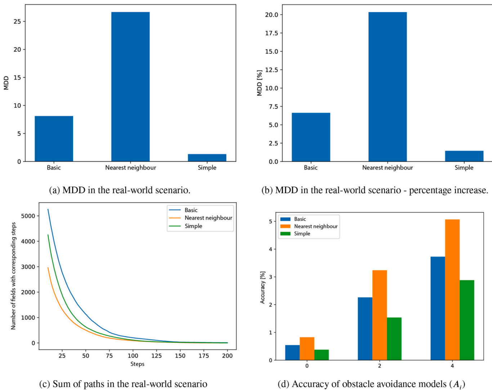

Fig. 9. Results for the real-world scenario simulation.

field, so their path length will not exactly match the one calculated in Dijkstra's algorithm. The model choosing the nearest field among equal ones achieved significantly higher results than the basic model (26.6 and 8.1, respectively). This difference is much more drastic than between models with similar operation differences (see section 4.2). The larger area of the examined space most likely causes such a result. The difference in area causes greater distances between agents and, consequently, more chances to highlight the difference between the operation of the models.

When choosing a low threshold for path creation, the model choosing the nearest field creates the shortest path networks (Fig. 9c). However, the SP values are visibly low. The results for all three models converge close to zero at around 125 fields. This situation is most likely also due to the larger area of the studied area. In the simulations of the real-world scenario, the area was examined four times, and 49 buildings were found. This causes the agents to travel significantly fewer routes in the same number of simulation steps, and their journeys will be much longer. They will, therefore, leave their traces on a higher number of fields, leaving each of them less worn.

An additional measure collected in this scenario is accuracy (Fig. 9d). High accuracy means a better representation of pedestrian behaviour. The highest accuracy was achieved by the model choosing the nearest fields. Following the shortest possible path, the simplified model achieved the worst result at 60 % accuracy of the above. These results may indicate that pedestrians prioritise the space closest to them in the path selection process, ignoring the overall increase in route length. Another reason for these results may be that the model choosing the nearest fields will more readily stay on sidewalks. In contrast, the basic obstacle

avoidance model shows a greater tendency to “cut corners” to reach a convenient field closer to the destination. This way, the second of these models will create more paths, reducing the accuracy value.

Unlike Ma et al., who primarily focused on a straightforward agent-based model emphasizing visual parameters and basic affordance-based path formation, our extended framework integrates weighted prefer-ences and obstacle-aware principles, enabling more nuanced pedestrian decision-making. This led to more realistic simulations of complex urban scenarios, significantly where multiple competing priorities and non-trivial obstacles influenced pedestrian routes. While Ma et al. achieved initial insight into how desire paths emerge, our results show a broader range of likely outcomes that align more closely with observed human behaviour. This not only substantiates the added complexity of our models but also demonstrates their potential for informing more adap-tive infrastructure planning decisions.

#  4.4. Limitation and future works

One fundamental limitation lies in the performance of the obstacle avoidance model, which, while showing promise, was only able to achieve around 60% accuracy. Currently, the model restricts pedestrian movement to polygonal paths, resulted in less naturalistic behaviour than real-world observations. This limitation highlights the need for further refinement to achieve more human-like path choices. A possible future direction could be incorporating dynamic obstacle avoidance techniques involving strategic (long-term) and tactical (short-term) decision-making processes. This approach could enhance the agents' ability to react to unforeseen obstacles while maintaining natural

movement.

Incorporating more complex behavioural parameters, such as environmental factors (e.g., weather, time of day) or social influences (e.g., group behaviour), could improve the model's accuracy in predicting real-world desire paths. In future research, the impact of psychological and sociocultural factors, often overlooked in agent-based models, should be explored to enhance the representation of pedestrian decision-making.

Next improvement could be the refining the footprint model. One proposal in this regard is to introduce graduated visibility of footprints perceived by agents. In real-world scenarios, desire paths begin to form with surface degradation, which is not immediately visible after a single crossing, but only after frequent pedestrian movement. In its current form, an agent, upon seeing a field with a single footprint, will choose it over fields without footprints. A proposed solution to this issue is introducing another value describing the field—wear. Wear would increase incrementally with additional footprints on the field. The nature of these increments could be adjustable. Wear could increase linearly (e. g., by one every ten new steps) or logarithmically (requiring more and more steps to increase wear). Specific values and the behaviour of the surface could also be examined to see how they influence agent behaviour.

Another improvement could involve the use of regenerating surfaces. Fields with a low number of footprints could regenerate, thus gradually guiding pedestrians more onto established paths with higher levels of degradation. The idea of footprints disappearing over time resembles ant simulations, where agents leave behind pheromones that dissipate over time. In this case, creating a path would slow its disappearance.

A potential extension of this work involves modelling how agents perceive and navigate more minor, subtler obstacles—such as low hedges or rows of plants—that may not uniformly impede pedestrian movement. While a determined individual might simply hop over a small barrier, another might walk around it, depending on factors like perceived effort, personal mobility, or social norms. Incorporating these nuances would allow the model to reflect better the varied decision-making strategies observed in real-world pedestrian environments. By assigning differing “effort costs” to actions like hopping or detouring, the simulation could more accurately capture the complexity of pedestrian behaviours, thereby enhancing its predictive power and practical relevance.

Finally, the empirical validation of the models was limited to a single urban area, which restricts the general applicability of the findings. Future studies should test the models in diverse geographical and cultural contexts to ensure broader applicability. Integrating real-time data collection, such as using sensors or GPS tracking of pedestrian movements, could offer more dynamic feedback for the models, allowing for ongoing refinements based on observed behaviour patterns.

#  5. Conclusions

The results of the conducted simulations provide important insights into the formation of desire paths in urban spaces. The analysis of agent behaviour in various models allowed for a better understanding of the dynamics of the creation of these informal routes. The models proposed in this work offer a broader perspective on pedestrian behaviour. In particular, the obstacle avoidance model enables the use of agent-based simulations in analyses based on more diverse areas.

A key contribution of this work is the introduction of the weighted preferences model. It indicates that local optimisation of route length does not always lead to the minimisation of the resulting path network. Moreover, the resulting networks are largely dependent on pedestrian priorities. Pedestrians who prefer to stay within the existing infrastructure will influence the network differently than those who prefer to use shorter paths.

In this work, a new obstacle avoidance agent model was also proposed. It is a good attempt to address the shortcomings of the other

models. However, it is limited due to the general directions of movement, which reduce the paths it creates to polygonal shapes that bear less resemblance to natural ones. An accuracy around 60 % suggests that this model requires refinement, but it is a step in the right direction.

In conclusion, while this study makes notable contributions to understanding the dynamics of desire path formation, several avenues for improvement and further research remain. These include refining obstacle avoidance algorithms, exploring more complex pedestrian preferences, enhancing the scalability of the simulations, and broadening the scope of empirical testing. Addressing these limitations could significantly improve the practical application of agent-based models in urban planning, ultimately developing more pedestrian-friendly environments.

#  CRediT authorship contribution statement

Józef Bossowski: Visualization, Software, Methodology, Investigation. Tomasz Szandała: Writing – review & editing, Writing – original draft. Jacek Mazurkiewicz: Validation, Supervision, Conceptualization.

#  Data availability

Software is being updated to newest version and link to GitHub will be added

#  References

Almulhim, A. I., & Cobbinah, P. B. (2023). Can rapid urbanization be sustainable? The case of saudi arabian cities. Habitat International, 139(2023), Article 102884.

Aronson, E., Wilson, T. D., & Akert, R. M. (1994). Social psychology: The heart and the mind. 1994. HarperCollins College Publishers.

Chan, E. T., Schwanen, T., & Banister, D. (2021). The role of perceived environment, neighbourhood characteristics, and attitudes in walking behaviour: Evidence from a rapidly developing city in China. Transportation, 48(2021). 431-454.

Cheliotis, K. (2021). ABMU: An agent-based modelling framework for Unity3D. SoftwareX, 15.

Cocola-Gant, A., Gago, A., & Jover, J. (2020). Tourism, gentrification and neighbourhood change: An analytical framework-reflections from southern european cities. In, 2020. The overtourism debate: NIMBY, nuisance, commodification (pp. 121–135). Emerald Publishing Limited.

Ćwik, A., & Ćwik, E. (2011). Antropopresja w rezerwacie "Lisia Góra" w Rzeszowie. Chrońmy Przyrode Ojczystą, 67(5), 441–448.

Dijkstra, E. (1959). A note on two problems in connexion with graphs. Numerische Mathematik, 1(1).

Downney, A. (2012). Think complexity (1st ed.) (1st ed., 2012. Green Tea Press.

Edwards, W. (1962). Subjective probabilities inferred from decisions. Psychological Review, 69(2).

Farrier, D. (2020). Desire paths, dostep 14.06.2024.

Filomena, G., & Verstegen, J. A. (2021). Modelling the effect of landmarks on pedestrian dynamics in urban environments. Computers, Environment and Urban Systems, 86 (2021), Article 101573.

Gibson, J. J. (1977). The theory of affordances, Hilldale, USA. 1(2), 67–82.

Goheen, P. G. (1993). The ritual of the streets in mid-19th-century Toronto. Environment and Planning: Society and Space, 11(2).

Grisiute, A., Wiedemann, N., Herthogs, P., & Raubal, M. (2024). An ontology-based approach for harmonizing metrics in bike network evaluations. Computers, Environment and Urban Systems, 113, Article 102178.

Helbing, D., Molnár, P., Farkas, I. J., & Bolay, K. (2001). Self-organizing pedestrian movement. Environment and Planning B: Planning and Design, 28(3), 361–383. https://doi.org/10.1068/b2697

Herrick_I (1982) The OSIU Oval dosten 14 06 2024

Heck, J., Cui, Y., Zhang, L., Tong, W., Shi, Y., & Liu, Z. (2022). An overview of agent-based models for transport simulation and analysis. Journal of Advanced Transportation, 2022(1), 1252534.

Kaziyeva, D., Stutz, P., Wallentin, G., & Loidl, M. (2023). Large-scale agent-based simulation model of pedestrian traffic flows. Computers, Environment and Urban Systems, 105(2023), Article 102021.

Le Bon, G. (1896). Psychologie des foules. Ancienne librairie Germer Baillière et Cie, 1896.

Lee, S., Son, Y.-J., & Jin, J. (2008). Decision field theory extensions for behavior modeling in dynamic environment using bayesian belief network. Information Sciences. 178(10). 2297-2314. https://doi.org/10.1016/i.ins.2008.01.009

Lee, S.-J. (2015). Navigational pedestrian movement model with vision-driven agents. Journal of Asian Architecture and Building Engineering, 14(2), 371-378. https://doi.org/10,3130/jaabe.14.371

Lobo, L., Heras-Escribano, M., & Travieso, D. (2018). The history and philosophy of ecological psychology. Frontiers in Psychology, 9, Article 403987.

Ma, L., Brandt, S. A., Seipel, S., & Ma, D. (2024). Simple agents-complex emergent path systems: Agent-based modelling of pedestrian movement. Environment and Planning B: Urban Analytics and City Science. 51(2). 479–495.

Maciak, T., & Barański, M. (2015). Wprowadzenie do komputerowego modelowania zachowania się thumu. wybrane aspekty psychologii thumu. Safety & Fire Technology, 40. 39–49.

Parysek, J. J. (2010). Urban policy in the context of contemporary urbanisation processes and development issues of polish cities. Journal of Urban and Regional Analysis, 2(2), 33-44.

Payne, J. W. (1982). Contingent decision behavior. Psychological Bulletin, 92(2).

Rao, A. S., & Georgeff, M. P. (1998). Decision procedures for BDI logics. Journal of Logic and Computation, 8(3), 293–343, 06 1998 https://doi.org/10.1093/logcom/8.3.293.

Real, P., Martínez-Gil, F., Martínez-Durá, R. J., & García-Fernández, I. (2019). Procedural location of roads using desire paths. 2019 pp. 19–24). CEIG.

Reynolds, C. W. (1987). Flocks, herds and schools: A distributed behavioral model.

SIGGRAPH Comput. Graph, 21(4), 25-34. https://doi.org/10.1145/37402.37406

Rhoads, D., Solé-Ribalta, A., & Borge-Holthoefer, J. (2023). The inclusive 15-minute city: Walkability analysis with sidewalk networks. Computers, Environment and Urban Systems, 100(2023), Article 101936.

Ronald, N., Sterling, L., Kirley, M., et al. (2007). An agent-based approach to modelling pedestrian behaviour. International Journal of Simulation, 8(1), 25–38.

Schelling, T. C. (1971). Dynamic models of segregation. The Journal of Mathematical Sociology, 1(2), 143–186.

Sopiana, Y., & Harahap, M. A. K. (2023). Sustainable urban planning: A holistic approach to balancing environmental conservation, economic development, and social well-being. West Science Interdisciplinary Studies. 1(02). 43-53.

Torrens, P. M., & Gu, S. (2023). Inverse augmentation: Transposing real people into pedestrian models. Computers, Environment and Urban Systems, 100(2023), Article 101923.

Turner, A., & Penn, A. (2002). Encoding natural movement as an agent-based system: An investigation into human pedestrian behaviour in the built environment.

Environment and planning B: Planning and Design, 29(4), 473–490.

Unity Technologies. (2024). Unity (wersja 2022.3.11f1) [oprogramowanie], dostęp 15.06.2024. URL https://unity.com/.

Zare, P., Leao, S., Gudes, O., & Pettit, C. (2024). A simple agent-based model for planning for bicycling: Simulation of bicyclists' movements in urban environments.

Computers, Environment and Urban Systems, 108(2024), Article 102059.

Zipf, G. K. (2016). Human behavior and the principle of least effort: An introduction to human ecology. Ravenio Books, 2016.

